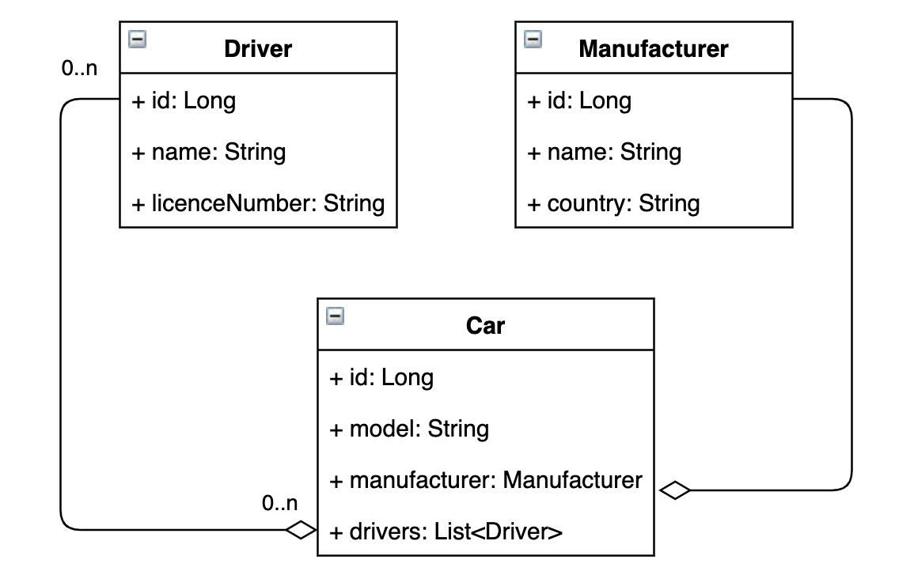

# Taxi-service

This is a simple web-application that allows authenticated users to keep records of cars and drivers for small Taxi services.

Allows you to display a list of cars, manufacturers and drivers. It is possible to add new  
manufacturers with the indication of the country production, add new vehicles with model and manufacturer.   
Maintain a list, add, remove drivers, as well as attach / detach drivers to a specific car.

### Using technologies
* Dependency injection
* Java Servlet 4.0.1
* JDBC
* JDK 11
* JSP
* Maven 4.0.0
* MySQL 8.0.22
* Tomcat 9.0.50

### Using design patterns
* N-tier architecture
* SOLID

### Project structure
Project structure is represented by N-tier architecture and consists 3 levels:
* Controllers
* Service
* DAO

### Instructions
1. Install and configure Tomcat server (recommended to use version 9.0.50)
2. Clone this project from Git
3. Create DB schema and tables using scripts in /resources/init_db.sql file
4. Change connection parameters in file /util/ConnectionUtil.java
5. Run and enjoy

### DB UML-diagram
